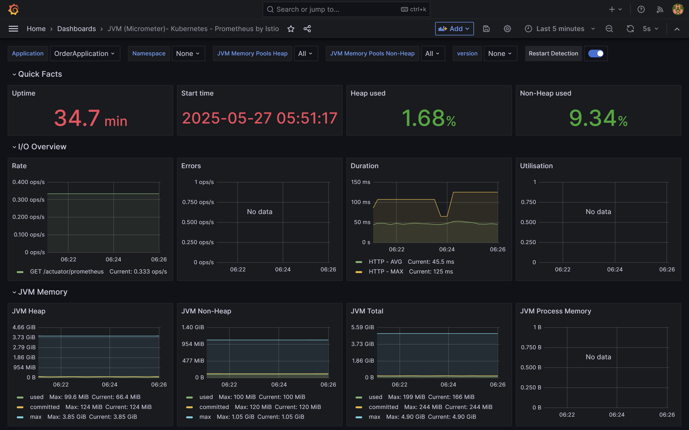
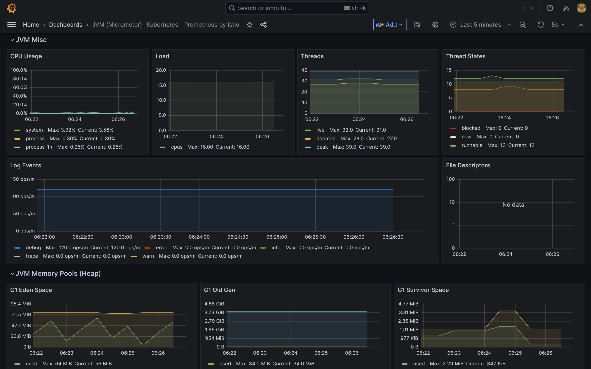
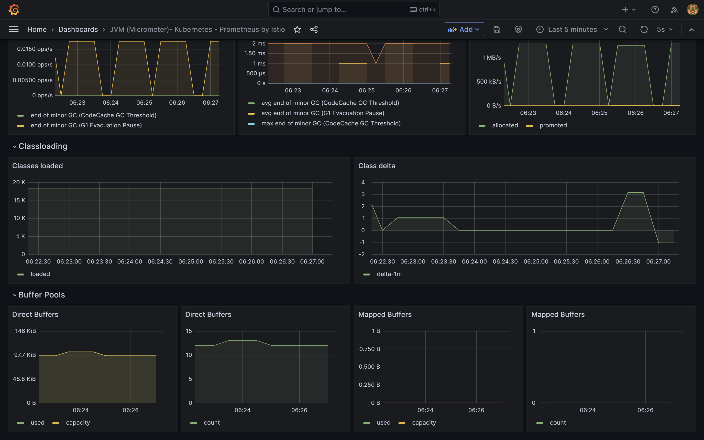

# PerbaikiinAja - Order Service

This project is responsible for managing the full process of placing and handling repair service requests, from initial order creation to final completion. Users can place new repair orders, specifying item details, desired repairs, choosing a payment method, and optionally selecting their preferred technician. Technicians receive these orders, provide cost and time estimates, and update the order status as repairs progress. After technicians mark repairs as completed, users receive notifications and can view, manage, or delete these notifications to stay informed without clutter.

## API Reference

### Notifications Endpoints

All endpoints in this section require a valid JWT token in the `Authorization` header:

`Authorization: Bearer <jwt-token>`

#### Get Notifications

```http
GET /notifications
```

**Description:**  
Retrieves a list of notifications for the authenticated user. When the notifications are retrieved, their status will be updated so that each notification’s `isRead` flag is set to `true`.

**Response:**

```json
[
  {
    "id": "f47ac10b-58cc-4372-a567-0e02b2c3d479",
    "userId": "a3dda38c-0819-4ee0-ba4f-f124180219e9",
    "title": "Repair Completed",
    "message": "Your repair request #12345 has been completed.",
    "isRead": true,
    "createdAt": "2025-04-09T20:54:40"
  },
  {
    "id": "c9bf9e57-1685-4c89-bafb-ff5af830be8a",
    "userId": "a3dda38c-0819-4ee0-ba4f-f124180219e9",
    "title": "Repair Completed",
    "message": "Your repair request #67890 has been completed.",
    "isRead": true,
    "createdAt": "2025-04-09T21:00:10"
  }
]
```

---

#### Delete Notification

```http
DELETE /notifications/{notificationId}
```

**Description:**  
Deletes a single notification by its ID if it belongs to the authenticated user.

**Path Parameter:**

| Parameter       | Type   | Description                      |
| --------------- | ------ | -------------------------------- |
| `notificationId` | UUID  | **Required**. ID of the notification to delete. |

**Response:**  
A successful response returns an HTTP 200 status. If the notification is not found or the user is not authorized to delete it, an error message is returned.

---

### Orders Endpoints

All endpoints in this section require a valid JWT token in the `Authorization` header:

`Authorization: Bearer <jwt-token>`

#### Create Order

```http
POST /orders
```

**Description:**
Creates a new order for the authenticated user. The customer ID is automatically extracted from the JWT token.

**Request Body:**
```json
{
  "itemName": "iPhone 14 Pro",
  "itemCondition": "Screen cracked",
  "repairDetails": "Replace screen and check internal components",
  "serviceDate": "2025-06-01T10:00:00",
  "technicianId": "b1234567-8901-2345-6789-012345678901",
  "paymentMethodId": "c2345678-9012-3456-7890-123456789012",
  "couponId": "d3456789-0123-4567-8901-234567890123",
  "estimatedCompletionTime": "2025-06-03T16:00:00",
  "estimatedPrice": 250000
}
```

**Response:**
```json
{
  "order": {
    "id": "f47ac10b-58cc-4372-a567-0e02b2c3d479",
    "customerId": "a3dda38c-0819-4ee0-ba4f-f124180219e9",
    "itemName": "iPhone 14 Pro",
    "itemCondition": "Screen cracked",
    "repairDetails": "Replace screen and check internal components",
    "serviceDate": "2025-06-01T10:00:00",
    "technicianId": "b1234567-8901-2345-6789-012345678901",
    "paymentMethodId": "c2345678-9012-3456-7890-123456789012",
    "couponId": "d3456789-0123-4567-8901-234567890123",
    "estimatedCompletionTime": "2025-06-03T16:00:00",
    "estimatedPrice": 250000,
    "finalPrice": null,
    "completedAt": null,
    "createdAt": "2025-05-27T10:30:00"
  },
  "message": "Order created successfully"
}
```

#### Get Order History

```http
GET /orders
```

**Description:**
Retrieves all orders for the authenticated user.

**Response:**
```json
{
  "orders": [
    {
      "id": "f47ac10b-58cc-4372-a567-0e02b2c3d479",
      "customerId": "a3dda38c-0819-4ee0-ba4f-f124180219e9",
      "itemName": "iPhone 14 Pro",
      "itemCondition": "Screen cracked",
      "repairDetails": "Replace screen and check internal components",
      "serviceDate": "2025-06-01T10:00:00",
      "estimatedPrice": 250000,
      "finalPrice": 230000,
      "status": "COMPLETED",
      "createdAt": "2025-05-27T10:30:00",
      "completedAt": "2025-06-03T15:45:00"
    }
  ]
}
```

#### Get Order Detail

```http
GET /orders/{orderId}
```

**Description:**
Retrieves detailed information for a specific order. Users can only access their own orders.

**Path Parameter:**
| Parameter       | Type   | Description                      |
| --------------- | ------ | -------------------------------- |
| `orderId` | UUID  | **Required**. ID of the order to retrieve. |

**Response:**
```json
{
  "id": "f47ac10b-58cc-4372-a567-0e02b2c3d479",
  "customerId": "a3dda38c-0819-4ee0-ba4f-f124180219e9",
  "itemName": "iPhone 14 Pro",
  "itemCondition": "Screen cracked",
  "repairDetails": "Replace screen and check internal components",
  "serviceDate": "2025-06-01T10:00:00",
  "technicianId": "b1234567-8901-2345-6789-012345678901",
  "paymentMethodId": "c2345678-9012-3456-7890-123456789012",
  "couponId": "d3456789-0123-4567-8901-234567890123",
  "estimatedCompletionTime": "2025-06-03T16:00:00",
  "estimatedPrice": 250000,
  "finalPrice": 230000,
  "completedAt": "2025-06-03T15:45:00",
  "createdAt": "2025-05-27T10:30:00"
}
```


#### Update Order

```http
PUT /orders/{orderId}
```

**Description:**
Updates an existing order. Users can only update their own orders. Only non-null fields in the request body will be updated.

**Path Parameter:**
| Parameter       | Type   | Description                      |
| --------------- | ------ | -------------------------------- |
| `orderId` | UUID  | **Required**. ID of the order to update. |

**Request Body:**
json{
  "itemName": "iPhone 14 Pro Max",
  "repairDetails": "Replace screen, battery, and check internal components",
  "estimatedPrice": 300000
}

**Response:**
```json
{
  "id": "f47ac10b-58cc-4372-a567-0e02b2c3d479",
  "customerId": "a3dda38c-0819-4ee0-ba4f-f124180219e9",
  "itemName": "iPhone 14 Pro Max",
  "itemCondition": "Screen cracked",
  "repairDetails": "Replace screen, battery, and check internal components",
  "serviceDate": "2025-06-01T10:00:00",
  "technicianId": "b1234567-8901-2345-6789-012345678901",
  "paymentMethodId": "c2345678-9012-3456-7890-123456789012",
  "couponId": "d3456789-0123-4567-8901-234567890123",
  "estimatedCompletionTime": "2025-06-03T16:00:00",
  "estimatedPrice": 300000,
  "finalPrice": null,
  "completedAt": null,
  "createdAt": "2025-05-27T10:30:00"
}
```


#### Cancel Order

```http
DELETE /orders/{orderId}
```

**Description:**
Cancels/deletes an order. Users can only cancel their own orders.

**Path Parameter:**
| Parameter       | Type   | Description                      |
| --------------- | ------ | -------------------------------- |
| `orderId` | UUID  | **Required**. ID of the order to cancel. |

Response:
A successful response returns an HTTP 204 (No Content) status. If the order is not found or the user is not authorized to cancel it, an error status is returned.

#### Get All Orders (Admin)
Requires ADMIN role in addition to a valid JWT token.

```http
GET /orders/admin
```

**Description:**
Retrieves all orders in the system. This endpoint is only accessible by users with ADMIN role.

**Response:**
```json
{
  "orders": [
    {
      "id": "f47ac10b-58cc-4372-a567-0e02b2c3d479",
      "customerId": "a3dda38c-0819-4ee0-ba4f-f124180219e9",
      "itemName": "iPhone 14 Pro",
      "itemCondition": "Screen cracked",
      "repairDetails": "Replace screen and check internal components",
      "serviceDate": "2025-06-01T10:00:00",
      "estimatedPrice": 250000,
      "finalPrice": 230000,
      "status": "COMPLETED",
      "createdAt": "2025-05-27T10:30:00",
      "completedAt": "2025-06-03T15:45:00"
    },
    {
      "id": "c9bf9e57-1685-4c89-bafb-ff5af830be8a",
      "customerId": "b4eeb28c-1820-5ff1-cb5f-g235291320f0",
      "itemName": "Samsung Galaxy S24",
      "itemCondition": "Battery draining fast",
      "repairDetails": "Replace battery",
      "serviceDate": "2025-06-02T14:00:00",
      "estimatedPrice": 150000,
      "finalPrice": null,
      "status": "IN_PROGRESS",
      "createdAt": "2025-05-28T09:15:00",
      "completedAt": null
    }
  ]
}
```

**Error Responses**
All order endpoints may return the following error responses:
- 403 Forbidden: User does not have permission to access the resource
- 404 Not Found: The requested order does not exist
- 500 Internal Server Error: An unexpected error occurred


## Environment Configuration

Before running the application, create a `.env` file in the project root with the following example settings. Replace these dummy values with your actual configuration as needed.

```dotenv
# Database
DATABASE_URL=jdbc:postgresql://localhost:5432/perbaikiinaja
DATABASE_USERNAME=your_db_username
DATABASE_PASSWORD=your_db_password

# JWT
# The decoded secret must be at least 512 bits (64 bytes) in length.
JWT_SECRET="your_jwt_secret_key"
```

---

### **Software Design**

**SOLID Principles**
- **Single Responsibility Principle (SRP)**: Kode yang dibuat sudah mengikuti prinsip ini, seperti Setiap OrderController menangani HTTP request dan validasi authorization, OrderService mengelola logika bisnis dan business rules, OrderRepository menangani akses data, dan Order model merepresentasikan struktur entitas order.
- **Open/Closed Principle (OCP)**: Interface OrderService memungkinkan perluasan fungsionalitas tanpa perlu memodifikasi kode yang sudah ada, seperti penambahan metode baru untuk operasi order yang lebih kompleks.
- **Liskov Substitution Principle (LSP)**: Penerapan abstraksi sudah bersifat konsisten, terutama dalam implementasi OrderServiceImpl yang mengikuti kontrak interface OrderService, memastikan substitusi yang sesuai.
- **Interface Segregation Principle (ISP)**: Interface OrderService hanya berisi metode yang relevan dan dibutuhkan untuk operasi order management seperti create, read, update, dan cancel operations.
- **Dependency Inversion Principle (DIP)**: Implementasi constructor injection pada OrderController dan OrderServiceImpl meminimalkan ketergantungan langsung antar komponen, menggunakan abstraksi interface daripada implementasi konkret.

**Maintainability**
- **Separation of Concerns**: Adanya pemisahan yang jelas antara lapisan controller (OrderController), service (OrderService), model (Order), akses data (OrderRepository), dan transfer objects (multiple DTOs).
- **Modularisasi**: Penggunaan multiple DTOs (OrderRequestDTO, OrderResponseDTO, UpdateOrderRequestDTO, OrderListResponseDTO) untuk memisahkan representasi data eksternal dari model internal, meningkatkan fleksibilitas sistem dan API versioning.
- **Readability**: Struktur kode terorganisir dengan penamaan metode yang intuitif dan self-documenting, seperti getOrdersByCustomerId, updateOrder, cancelOrder, dan getAllOrdersAdmin.
- **Testability**: Struktur mendukung unit testing dengan dependency injection dan separation of concerns yang memungkinkan mocking components untuk isolated testing.

**Design Patterns**

- **DTO (Data Transfer Object)**
  > Penerapan multiple DTOs untuk menyediakan representasi data yang sesuai dengan kebutuhan komunikasi client-server dan different use cases (create, update, response, list).

- **Builder Pattern**
  > Design pattern ini diimplementasikan pada OrderBuilder untuk memudahkan pembuatan objek Order dengan multiple required dan optional parameters secara terstruktur. Pattern ini dipilih karena model Order memiliki banyak parameter pada constructornya, dan pattern ini memungkinkan validasi parameter saat construction time sehingga memastikan objek selalu dalam keadaan valid dan konsisten.

---

### **Software Quality**

**Clean Code**
- **Separation of Concerns**: Pemisahan yang jelas antara penanganan request dan authorization (OrderController), logika bisnis dan business rules (OrderService), akses data (OrderRepository), dan transfer objects (multiple DTOs).
- **Naming Conventions**: Penamaan yang deskriptif dan konsisten untuk class, metode, dan variabel, seperti OrderController, getOrdersByCustomerId, createOrder, updateOrder, dan extractUserId yang menjelaskan fungsi secara eksplisit.
- **Readability**: Metode-metode pada kode dibuat secara ringkas dan fokus pada fungsi spesifik, dengan penggunaan method chaining pada CompletableFuture dan lambda expressions yang meningkatkan readability.
- **DRY Principle**: Implementasi helper method seperti extractUserId() dan updateFields() untuk menghindari code duplication dan centralized logic.

**Secure Coding**
- **Input Validation**: Validasi data masukan yang komprehensif pada DTOs dengan Jakarta validation annotations seperti @NotBlank, @NotNull, @FutureOrPresent untuk memastikan data integrity dan mencegah invalid input.
- **Role-Based Access Control**: Penerapan kontrol akses berdasarkan peran dengan @PreAuthorize("hasRole('USER')") dan @PreAuthorize("hasRole('ADMIN')") untuk membatasi akses ke operasi tertentu sesuai dengan priviledge level.
- **JWT Authentication**: Mekanisme autentikasi JWT melalui Authentication parameter yang diekstrak dari security context untuk mendapatkan user identity.
- **Exception Handling**: Global exception handler untuk menangani berbagai jenis error secara konsisten dengan proper HTTP status codes (403 Forbidden, 404 Not Found, 500 Internal Server Error).

**Testing**
- **Unit Testing**: Arsitektur kode yang mendukung unit testing dengan dependency injection, interface-based design, dan separation of concerns yang memungkinkan isolated testing.
- **Mocking**: Penggunaan mocking (`Mockito`) untuk memastikan bahwa unit tests tidak bergantung pada implementasi yang lebih besar, seperti database.

---

### **Software Deployment**

Terdapat workflow CI/CD (Continuous Integration/Continuous Deployment) yang meliputi scorecard, build process, testing suite, dan automated deployment. Pipeline CI/CD diimplementasikan menggunakan GitHub Actions, deployment dilakukan ke AWS Academy.

---

### **Profilling dan Monitoring**

#### Profiling dengan Intellij Profiler


Profilling dilakukan dengan menggunakan fitur IntelliJ Profiler untuk menganalisis performa aplikasi Order Management System. Profiling dilakukan dengan menjalankan aplikasi dalam mode profiler di IntelliJ sehingga dapat merekam aktivitas CPU, memori, serta panggilan metode secara detail selama aplikasi berjalan.

Profil performa menunjukkan beberapa bottleneck utama dalam aplikasi. Overhead refleksi yang tinggi terlihat pada pemanggilan java.lang.reflect.Method.invoke dan DirectMethodHandleAccessor.Invoke. Proses startup Spring Boot, seperti refreshContext dan createBean, menghabiskan banyak waktu, menunjukkan perlunya optimasi inisialisasi. Aaktivitas RestartLauncher.run mengindikasikan bahwa fitur DevTools yang digunakan dalam pengembangan mungkin tidak perlu dijalankan di lingkungan produksi. Selain itu, manajemen thread dan garbage collection juga memerlukan perhatian, terutama pada Thread.run dan ForkJoinWorkerThread. 

Untuk meningkatkan performa, terdapat beberapa pendekatan, seperti menonaktifkan DevTools di produksi akan menghilangkan overhead yang tidak diperlukan. Kemudian, optimasi manajemen thread dan memori, seperti menggunakan thread pooling dan mengurangi alokasi objek sementara, untuk membantu meningkatkan efisiensi.

#### Monitoring dengan SpringBoot Actuator, Prometheus, Grafana






Sistem monitoring OrderApplication diimplementasikan menggunakan kombinasi Spring Boot Actuator, Prometheus, dan Grafana untuk memberikan visibilitas komprehensif terhadap performa aplikasi dalam real-time.

**Komponen Monitoring:**
- **Spring Boot Actuator** memudahkan expose berbagai metrik penting aplikasi Order Management System (seperti HTTP request metrics, JVM memory usage, CPU utilization, database connection pool, dan custom business metrics untuk order operations) secara langsung tanpa perlu banyak konfigurasi manual.
- **Prometheus** sebagai time-series database yang handal untuk mengumpulkan dan menyimpan metrik aplikasi secara efisien, termasuk metrik khusus seperti jumlah order per status, response time untuk operasi CRUD order, dan throughput API endpoints.
- **Grafana** menyediakan visualisasi interaktif dan dashboard realtime yang mudah dikustomisasi, sehingga memudahkan pemantauan performa aplikasi secara komprehensif dengan alert notifications untuk kondisi abnormal.

**Arsitektur Monitoring:**
- Prometheus melakukan scraping terhadap endpoint `/actuator/prometheus` secara berkala setiap 3 detik (dikonfigurasi di prometheus.yml) untuk mengumpulkan metrik dari Order Management System.
- Grafana membaca data dari Prometheus datasource dan menampilkan metrik seperti JVM memory usage, CPU load, HTTP request rates, order creation rates, database query performance, dan CompletableFuture execution metrics dalam bentuk grafik dan panel interaktif.
